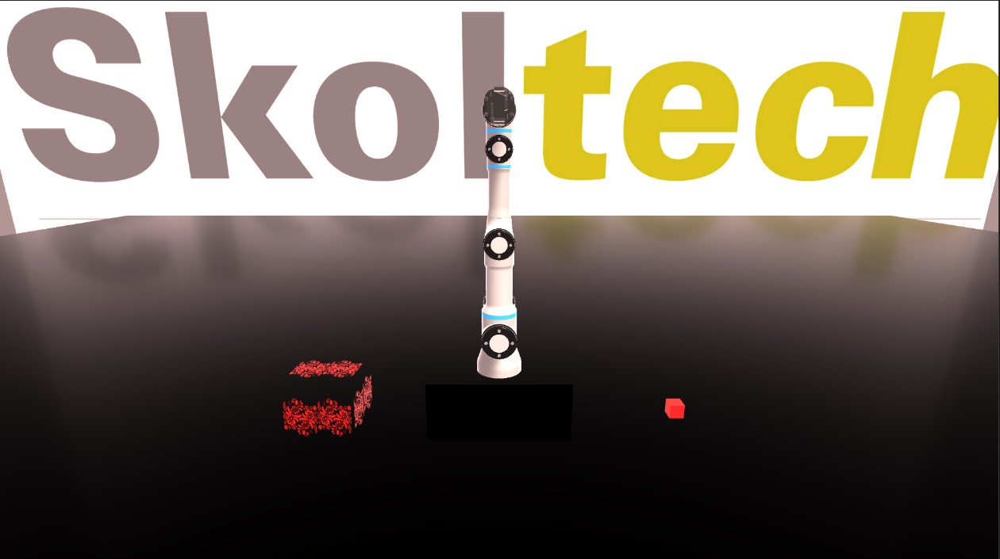

# About
This repository is designed for master's students to engage in practical learning of ROS2 through hands-on experiences. It includes a manipulator simulator built in Unity, allowing students to practice robotic manipulation in a virtual environment. Additionally, the repository provides examples of ROS nodes that facilitate communication between the Unity simulator and ROS2, enabling students to explore real-time interactions and data exchanges within robotics applications. This approach combines theoretical knowledge with practical skills, ensuring a comprehensive understanding of ROS2 and robotic systems. 

## Overview
This repository facilitates communication between the Unity manipulator simulator and ROS2, focusing on two primary data exchanges essential for robotic manipulation tasks: end-effector position and cube position.

### End-Effector Position
The simulator actively publishes the current position of the manipulator's end-effector. This data is critical for achieving precise control during manipulation tasks. Students will implement this feature by creating a ROS2 topic that allows other nodes to subscribe to updates, thereby enabling real-time responsiveness to the end-effector's movements.

### Cube Position
Equally important is the communication of the cube's position, which is the object intended for manipulation. This information is vital for determining the necessary movements to successfully place the cube into the designated box. Students will publish the cube's position and set up subscriptions to keep track of any updates, ensuring that the manipulator can interact with the cube effectively.

### Direct Joint Control
The project emphasizes the use of direct joint control methods in ROS2 for manipulating the robotic arm. By employing this approach, students can accurately move the end-effector to grasp the cube and subsequently place it into the box. This involves computing the appropriate joint angles based on the target end-effector position and utilizing ROS2 services or actions to execute these commands within the simulation.

This communication framework offers students a robust understanding of implementing control strategies in robotics using ROS2, enhancing their practical skills in an interactive environment.

# Requirements
ROS2 Environment
Linux/Windows PC with simulation
Connection between ROS station and PC

# How to
0) Download Released Unity simulator 
1) Create Workspace
2) Git clone ROS-TCP-Endpoint (do not forget to checkout to ROS2 branch)
3) Run ROS-TCP-Endpoint to get messages from simulation
4) Connect Unity simulator to ROS-TCP-Endpoint
5) Write ROS Node to control manipulator
6) Place object into the box

# Reference
[ROS-TCP-Endpoint]https://github.com/Unity-Technologies/ROS-TCP-Endpoint/tree/main
[Articulation Body Demo]https://github.com/Unity-Technologies/articulations-robot-demo.git

